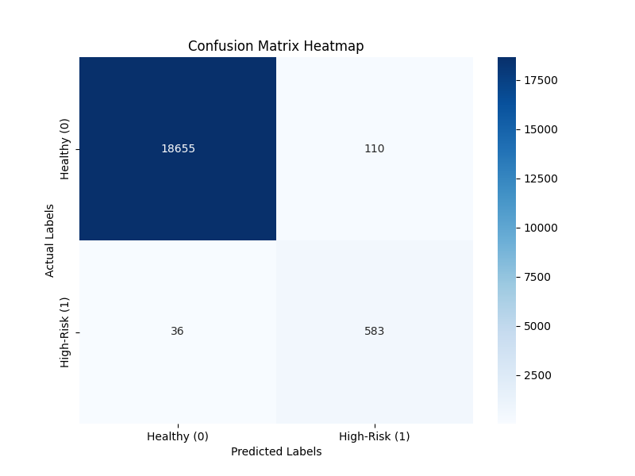

# credit-risk-classification
Supervised Machine Learning - Data Analytics Course Module 20

# Task
Train and evaluate a model based on loan risk using a dataset of historical lending activity from a peer-to-peer lending services company. Build a model that can identify the crediworthiness of borrowers.

# Methodology
1. Split the data into **training and testing** sets.
2. Create a **logistic regression model** with the original data.
   - Evaluate the model's performance:
   - Generate a confusion matrix.
   - Generate a classification report.
4. Write a Credit Risk Analysis report.

# Results
## Confusin Matrix Heat Map

# Analysis

